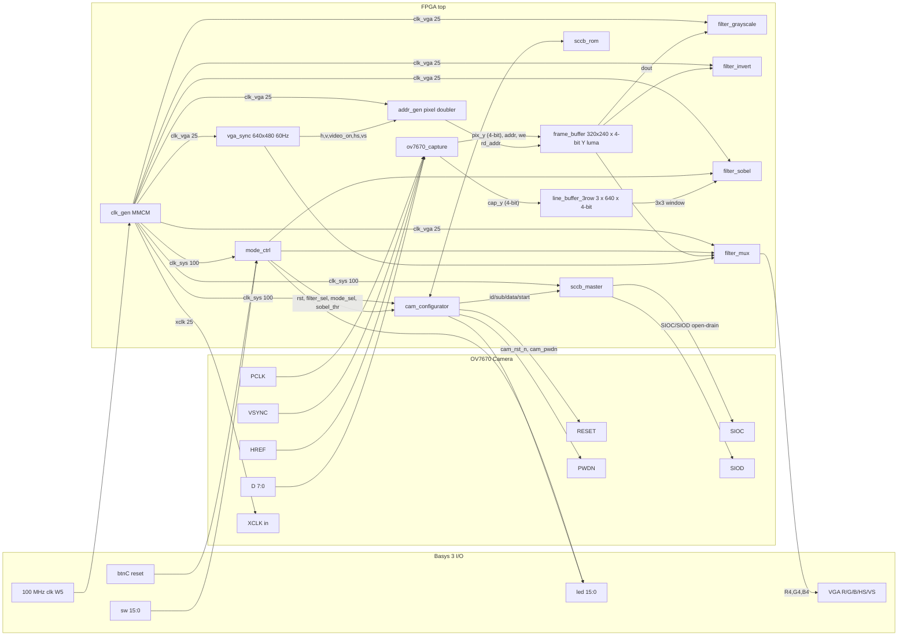

# System Block Diagram



## Clock domains (color-coded textually)

- **clk_in (100 MHz)** — only feeds the MMCM.
- **clk_sys (100 MHz)** — `mode_ctrl`, `cam_configurator`, `sccb_master`.
- **xclk (25 MHz)** — drives the camera.
- **cam_pclk (≈25 MHz, async)** — `ov7670_capture`, line buffer write
  port, frame-buffer write port.
- **clk_vga (25 MHz)** — `vga_sync`, `addr_gen`, every filter, the
  output mux, frame-buffer read port.

The only hard CDC is camera PCLK ↔ clk_vga, which is handled inside
`frame_buffer` (dual-clock BRAM).  `cam_vsync` and `frame_start` are
synchronized with 3-FF chains before use.

## Data paths (by mode)

### Mode A — 320x240 buffered

```
OV7670 (PCLK) -> ov7670_capture -> frame_buffer -> filters -> VGA
```

### Mode B — 640x480 stream-through

```
OV7670 (PCLK) -> ov7670_capture -> line_buffer_3row -> Sobel -> VGA
                                -> bypass path        -> raw/gray/invert -> VGA
```
